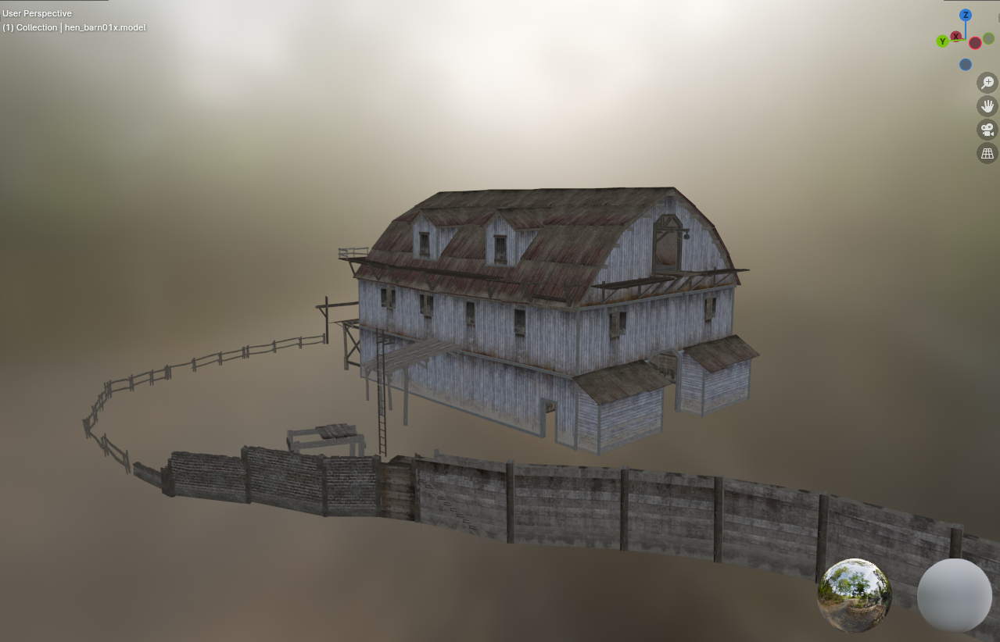
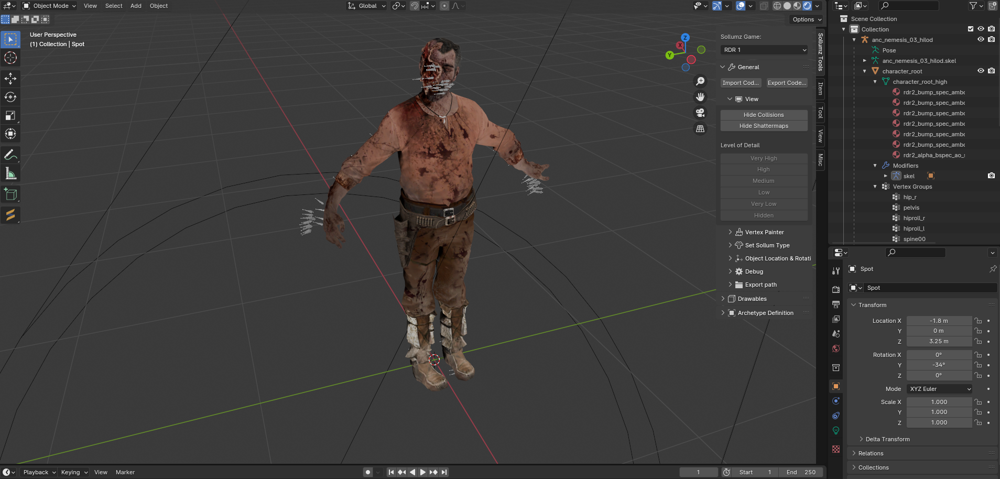
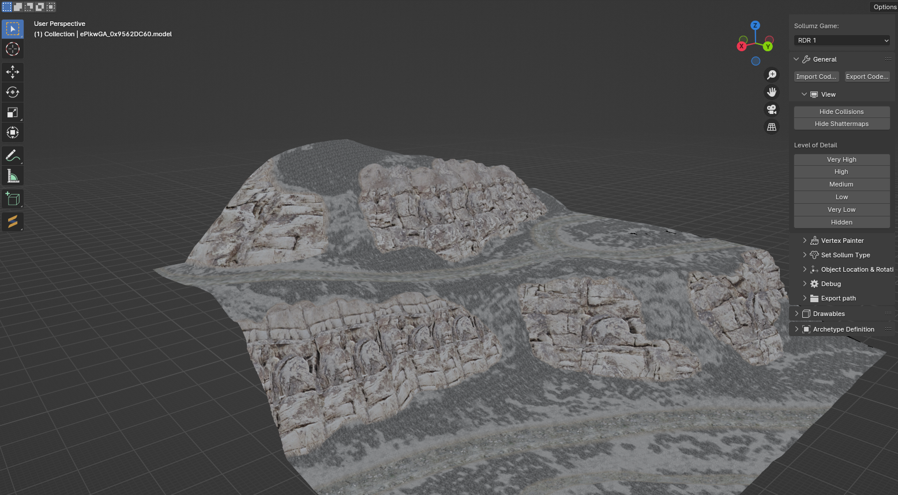

# WIP - Sollumz fork with RDR1 support for Blender 4.0

Allows you to import .wfd & .wvd XML file exported from CodeX.       

To export all separated textures using CodeX, open the model and click on `Export Selection`.      

In Blender, missing textures can be opened from `File>External data>Find missing files`.

# Random pictures

